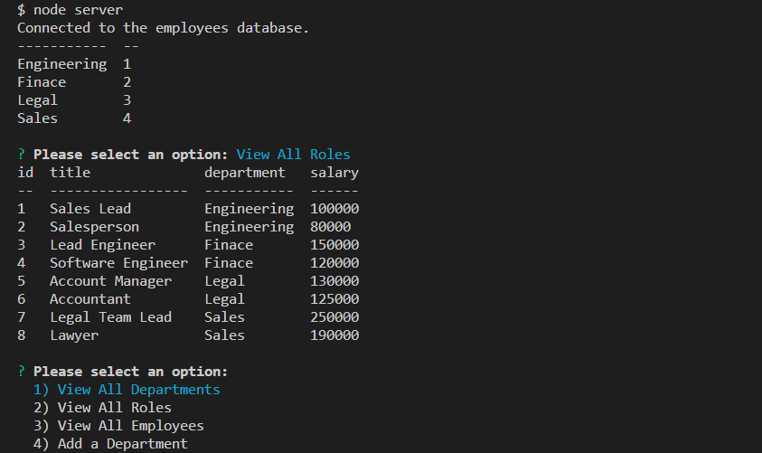
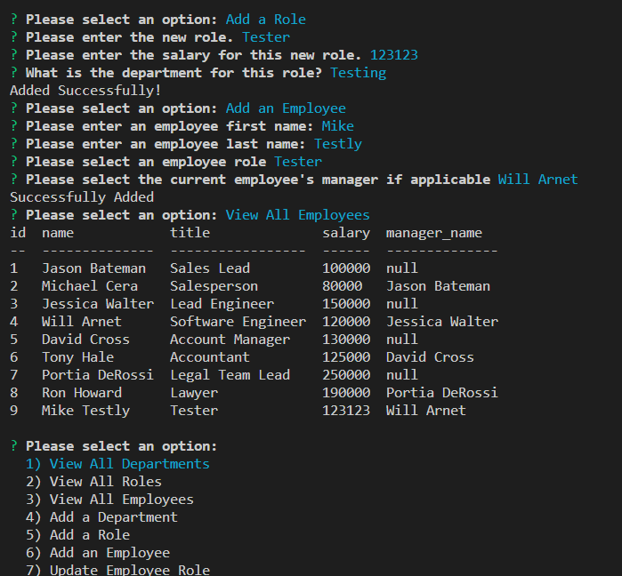

# employee-tracker-application

## Table of Contents
1. [Description](#description)
2. [Installation](#installation)
3. [Technology](#technology)
4. [Visuals](#visuals)
5. [License](#license)

## Description
[Video Walkthrough](https://drive.google.com/file/d/1SUQinhfsyiIi1YnH0uyLxQHZKmnI9VTL/view)
\
The goal of the Employee Tracker application is to provide the user with a contained environment to edit and compose a collection of employee information. Leveraging mysql and express this app creates a seeded mock database that can preform queries to access or change specific data pertaining to employees. 

The prompt module, handled via inquirer, guides the user through required fields and populates the SQL tables accordingly.

## Installation
Once you have cloned the repository to your local machine, first start with establishing the mock database environment. 

Run "mysql -u root" to instantiate the mysql shell. Once in this shell, you will need to first run "SOURCE db/schema.sql;" to establish our db structure. 

Following this, still within the mysql shell, run "SOURCE db/seeds.sql;" to seed the created tables with provided values. At this point you may type Exit to leave mysql. 

Now within your terminal, at the root level of the application, run "npm i" to pull in the remaining dependencies (mysql2, console.table, inquirer 8.2.4, and express). 

When all packages have installed, simply run "npm run start"  or "node server.js" to initialize process.
## Technology
[MySQL](https://www.mysql.com/) - Relational database management system based on SQL – Structured Query Language, employed in this application to house and query employee/department/company information.
\
[Express.js](https://expressjs.com/) - Used to govern middleware for end point connection between the frontend and backend processes/queries.
\
[Node.js](https://nodejs.org/en/) - Uses JavaScript to structure command line tool for server-side scripting.
\
[Inquirer](https://www.npmjs.com/package/inquirer) - Node Package that handles establishing prompt modules to accept, validate, submit, and update user input. 
Javascript - Server.js page establishes necessary npm installations, defines a local port to run app, instantiates inquirer prompt module, and defines necessary functions used to create, read, update, and delete various employee data sets.
## Visuals

## License
This application is licensed with the MIT License.